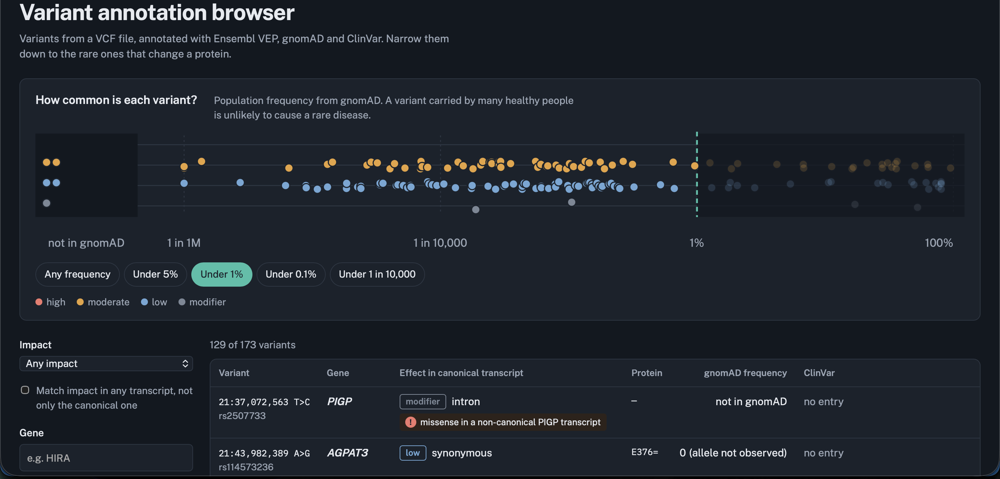

# Variant annotation browser

I built this project to learn how variant interpretation works in practice. It takes a VCF
file, annotates each variant with the Ensembl VEP REST API, saves the results in PostgreSQL
and shows them in a small web app where you can filter down to rare variants that change a
protein.

My background is in software engineering and genome visualisation (I worked on a web tool for
comparing long genome sequences during my degree), so I wanted to try the clinical side:
variants, transcripts, population frequencies and ClinVar.



## How it works

1. `pipeline/annotate_and_load.py` reads the VCF and sends the variants to Ensembl VEP in
   batches of 200. From the response it keeps the consequence for every transcript, gnomAD
   allele frequencies (exomes and genomes) and ClinVar significance.
2. Everything goes into PostgreSQL. There are two tables, `variants` and
   `transcript_consequences`, because one variant can hit dozens of transcripts. I also keep
   the full VEP response in a JSONB column so I don't have to call the API again if I need
   another field later.
3. `api/server.js` is a small Express API that returns one row per variant, with filters for
   frequency, impact, consequence and gene.
4. `web/` is a React app. At the top there is a frequency scale where each dot is a variant,
   and below it a table with filters. Clicking a variant opens a panel with all of its
   transcripts and links to Ensembl and gnomAD.

```
VCF → Python + Ensembl VEP → PostgreSQL → Node.js API → React
```

## Things I learned along the way

**The "most severe consequence" can be misleading.** At first I filtered on the most severe
consequence VEP reports for each variant. When I asked for rare variants with high impact, I
got two `stop_gained` variants, but when I looked at the transcripts, the stop codon only
appeared in non-canonical transcripts. In the canonical transcript both were synonymous, and
one of them is classified as likely benign in ClinVar. Showing only the canonical consequence
has the opposite problem, because a real effect in another transcript could be missed. So the
app now shows the canonical consequence and adds a warning when something more severe exists
in another transcript. The API has separate filters for both (`impact` and `worstImpact`).

**Frequency matters more than predictions.** One variant in the example data is a missense
change in ADA2, a gene linked to a rare disease. SIFT calls it deleterious, PolyPhen calls it
benign, and it is carried by about a third of people in gnomAD. A variant that common can't
cause a rare disorder, which is why the frequency scale is the main control in the interface.

**"Not in gnomAD" is not the same as zero.** A missing value means there is no data, zero
means the site was seen but the allele wasn't. Both count as rare in the filter, but the app
shows them differently.

## Running it locally

You need Python 3.11+, PostgreSQL 16 and Node.js 20+.

```bash
# database
createdb variants_db
psql variants_db -f db/schema.sql

# annotation
python3 -m venv .venv
source .venv/bin/activate
pip install requests "psycopg[binary]"
curl -o data/example_GRCh38.vcf \
  https://raw.githubusercontent.com/Ensembl/ensembl-vep/main/examples/homo_sapiens_GRCh38.vcf
python pipeline/annotate_and_load.py

# API, in one terminal
cd api && npm install && npm start

# web app, in another terminal
cd web && npm install && npm run dev
```

Then open http://localhost:5173.

## API

- `GET /api/variants` returns the variant list. Optional filters: `maxAf`, `impact`,
  `worstImpact`, `consequence`, `gene`.
- `GET /api/variants/:id` returns one variant with all of its transcripts.
- `GET /api/stats` returns counts for the summary panel.

All queries are parameterised, and `maxAf` and `id` are validated before they reach the
database.

## Data

The example VCF is the GRCh38 test file from the
[ensembl-vep](https://github.com/Ensembl/ensembl-vep) repository (173 variants on chromosomes
21 and 22). Annotations come from the public Ensembl VEP REST API.

## What's missing

- It uses Ensembl canonical transcripts. For clinical use MANE Select would be the better
  choice, and VEP can return it, so that's the next thing I'd change.
- There are no genotypes, inheritance or phenotypes, which real diagnostic tools depend on.
- The public REST API is fine for a small file, but a larger dataset would need a local VEP
  install.
- I'd like to add VCF upload from the browser and filtering by gene panel.
- There are no automated tests yet. The VCF parsing and frequency extraction are the first
  things I'd cover.
